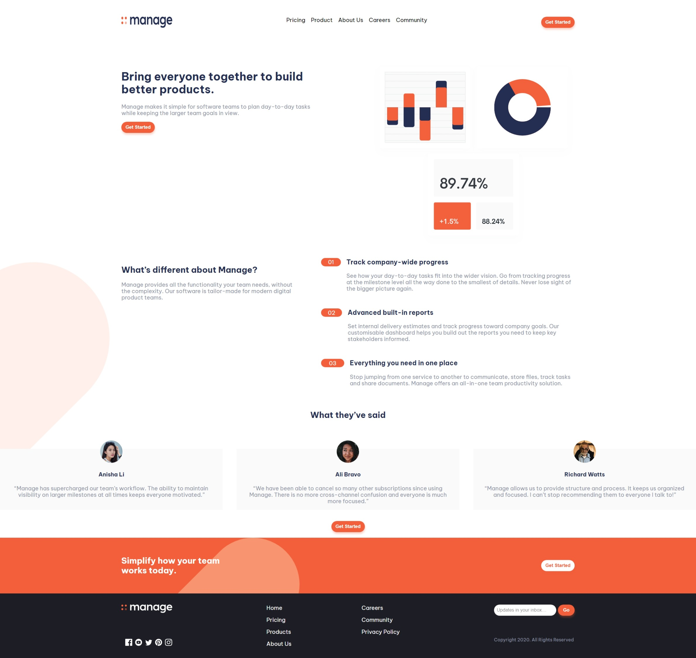
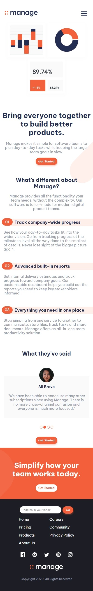

# Frontend Mentor - Manage landing page solution

This is a solution to the [Manage landing page challenge on Frontend Mentor](https://www.frontendmentor.io/challenges/manage-landing-page-SLXqC6P5).

## Table of contents

- [Overview](#overview)
  - [The challenge](#the-challenge)
  - [Screenshot](#screenshot)
  - [Links](#links)
- [My process](#my-process)
  - [Built with](#built-with)
  - [Useful resources](#useful-resources)
- [Author](#author)

## Overview

### The challenge

Users should be able to:

- View the optimal layout for the site depending on their device's screen size
- See hover states for all interactive elements on the page
- See all testimonials in a horizontal slider
- Receive an error message when the newsletter sign up `form` is submitted if:
  - The `input` field is empty
  - The email address is not formatted correctly

### Screenshot

On desktop:

On phone:

### Links

- Solution URL: [https://www.frontendmentor.io/challenges/manage-landing-page-SLXqC6P5/hub/responsive-landing-page-using-sass-and-reactjs-\_sCZ2mOddy](https://www.frontendmentor.io/challenges/manage-landing-page-SLXqC6P5/hub/responsive-landing-page-using-sass-and-reactjs-_sCZ2mOddy)
- Live Site URL: [https://justgo97.github.io/landing-page/](https://justgo97.github.io/landing-page/)

## My process

### Built with

- Semantic HTML5 markup
- Flexbox
- SASS
- [React](https://reactjs.org/) - JS library

### Useful resources

- [w3schools.com](https://www.w3schools.com/howto/howto_js_slideshow.asp) - This helped me for understanding how a slideshow works.

## Author

- Frontend Mentor - [@justgo97](https://www.frontendmentor.io/profile/justgo97)
- Linkedin - [hamdi20](https://www.linkedin.com/in/hamdi20/)
